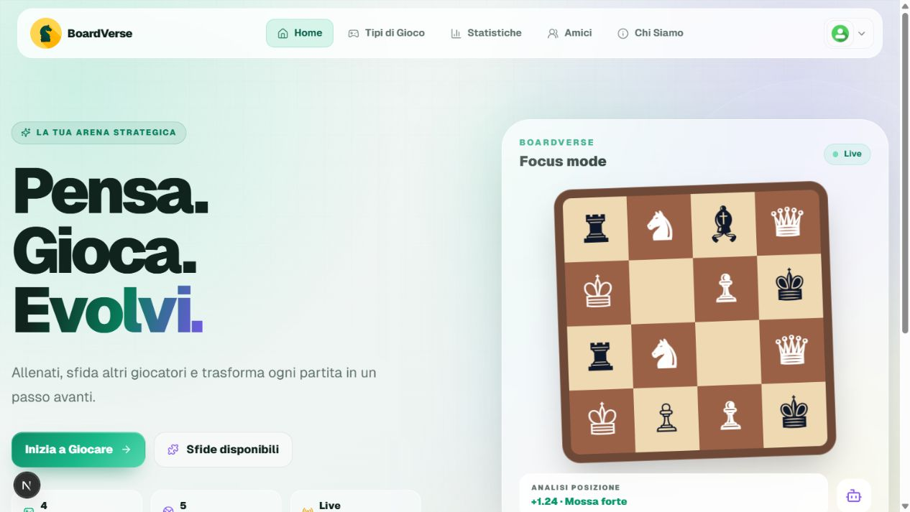
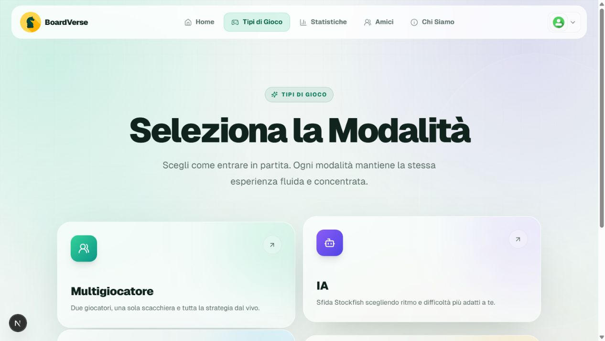
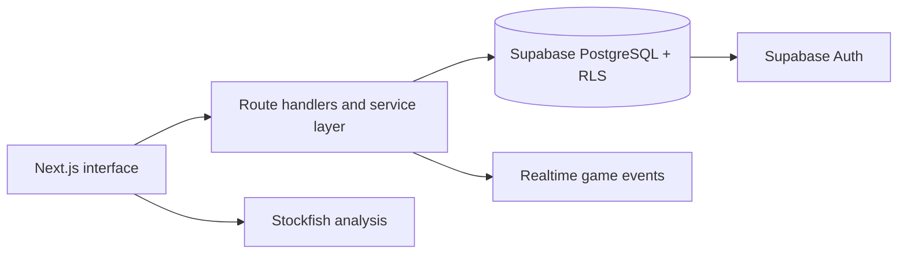

<div align="center">
  
  <h1>Boardverse</h1>
  <p><strong>A full-stack chess platform for live play, focused training and measurable progress.</strong></p>
  <p>
    <a href="#product-tour">Product tour</a> ·
    <a href="#engineering-highlights">Engineering</a> ·
    <a href="#run-locally">Run locally</a>
  </p>
</div>



Boardverse turns a classic chess application into a complete product experience:
authenticated profiles, private realtime games, Stockfish training, tactical
challenges, social features and persistent statistics in one responsive interface.

## Product tour

| Play your way | Build a complete player journey |
| --- | --- |
| Local multiplayer, Stockfish, private online rooms and curated challenges | Account recovery, friends, private messages, profiles, themes and statistics |
| Five interface languages | Responsive, accessible UI with dark and colour-blind modes |



## Engineering highlights

- **Realtime multiplayer:** create or join private timed rooms and persist moves.
- **Server-verified authentication:** Supabase sessions are validated before privileged operations.
- **Database security:** Row Level Security, explicit grants and authenticated RPCs protect sensitive game flows.
- **Chess intelligence:** `chess.js`, custom state logic and a Stockfish integration cover legal play and AI training.
- **Product-level UX:** multilingual copy, responsive navigation, loading states, themes and accessibility preferences.
- **Quality gates:** unit tests, browser smoke tests, linting and production builds run in CI.



## Stack

| Area | Implementation |
| --- | --- |
| Application | Next.js App Router, React, TypeScript |
| Data and identity | Supabase Auth, PostgreSQL, Realtime |
| Chess | `chess.js`, Stockfish, custom game state |
| Interface | Tailwind CSS, Headless UI, Three.js, Recharts |
| Verification | Vitest, Playwright, ESLint, GitHub Actions |

## Repository map

```text
src/app/                 pages, route handlers and UI components
services/                application-level data operations
lib/                     Supabase clients and server auth helpers
src/lib/                 chess and Stockfish logic with unit tests
supabase/migrations/     versioned schema and security policies
tests/                   Playwright smoke tests
```

## Run locally

Requirements: Node.js 22, npm and a compatible Supabase development project.

```bash
git clone https://github.com/JakeKing0001/boardverse.git
cd boardverse
cp .env.example .env.local
npm ci
npm run dev
```

Fill `.env.local` with the values documented in `.env.example`. Only the
publishable Supabase key belongs in browser code; `SUPABASE_SECRET_KEY` is
server-only and must never be committed or prefixed with `NEXT_PUBLIC_`.

The migrations evolve the project's existing schema. Review them against a
development database before applying them elsewhere; they are not presented as
a one-command bootstrap for an unrelated project.

## Quality checks

```bash
npm run lint
npm test
npm run build
npm run test:ui -- --project=desktop
```

## Project status

Boardverse is an actively developed portfolio project. Its security controls and
tests demonstrate production-minded engineering, but the repository is not
presented as an independently audited commercial service. A real deployment
should still validate the target schema, rate limits and complete multiplayer
flows in staging.

## License

Released under the [MIT License](LICENSE).
